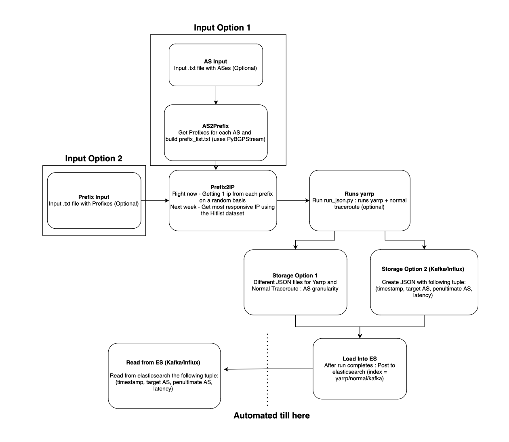

# Ioda-Upstream-Delay Yarrp Probing

Yarrp stands for Yelling at Random Routers Progressively and is a next-generation active network topology discovery technique and tool designed for rapid mapping at Internet scales.

To use yarrp for this project, install yarrp on your local system using the instructions mentioned in the repository [Yarrp](https://github.com/cmand/yarrp).
This reposity contains the following files and directories: 

- `run_json.py`: Runs Yarrp probe to a given prefix and gives a dictionary as output with information about the AS_path, tracerotue, latency and penultimate AS
To run the file use: `python3 run_json.py -r {rate} {input_prefix}`.
- `run_trace.py`: Runs normal traceroute to a given prefix and gives a dictionary as output with information about the AS_path, tracerotue, latency and penultimate AS
To run the file use: `python3 run_trace.py {input_prefix}`
- `probe.py`: Allows continous probing by calling both `run_json.py` and `run_trace.py` at custom time intervals.
To run the file, first create a `probe_input.txt` file with each line of the file being a destination prefix. Then run `python3 probe.py`

NOTE: `pyipmeta` is also required to run this project. 
You also need to add the latest CAIDA pfx2AS dataset to the path `./pyipmeta/CAIDA_Datasets/datasets/{file}` to access the latest ASNs for the given prefixes.

## Update

The following files are important for yarrp:

`as_list_test.txt`: Text file with 1 target AS on each line

`prefix_list_test.txt`: Text file with 1 target prefix on each line

`get_ip_list.py`: Gets the ip address from the prefix list using prefix2ip.json

`get_prefix_list`: Gets the prefix from the AS list using as2prefix.json

`probe.py`: Starting point of yarrp - need to run this using python3 probe.py -i <input list name> -t <type of input list: A/P> -r <probe rate>

`optimized_ip.txt`: Final list of ip addresses that will be fed into yarrp

`run_json.py`: Runs yarrp and gets the resulting .txt file - also calls yarrp_probe.py to format the received output and makes the post request to elasticsearch

`yarrp_probe.py`: Parses the output into individual json files based on the AS

`elastic_codes.py`: Has all the functions required to work with elasticsearch
